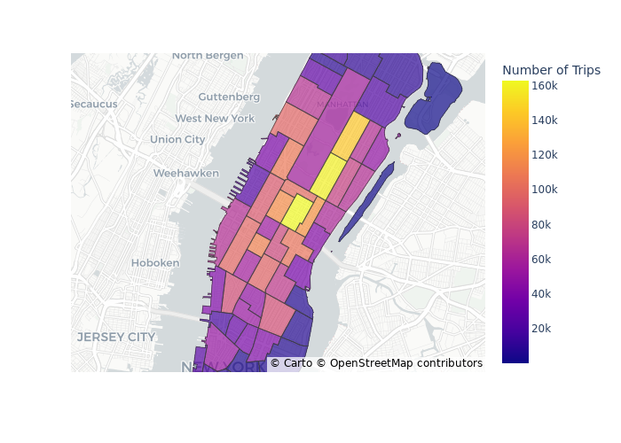

# NYC Taxi Data Analysis and Visualization Pipeline

## Project Description
This project utilizes **Dagster** and **DuckDB** to create a data pipeline for analyzing and visualizing New York City taxi trip data, specifically focusing on trips in Manhattan. The pipeline integrates geospatial analysis using **GeoPandas** and visualizes the results with **Plotly**. Key tasks include generating statistics on taxi trips by zone in Manhattan and analyzing weekly trip data, with outputs stored as CSV and GeoJSON files.

## Asset Graph

## Features

1. **Manhattan Taxi Trip Map Visualization:**
   - Creates a choropleth map visualizing the number of taxi trips per zone in Manhattan.
   - The map uses Plotly's Mapbox for a detailed and interactive visualization.
   - Outputs the map as an image file.

3. **Weekly Taxi Trip Aggregation:**
   - Aggregates taxi trip data on a weekly basis, summarizing total trips, distance, fare amount, and passenger count.
   - Results are saved as a CSV file for analysis.

## Dependencies
- **Dagster:** Orchestration of the data pipeline assets.
- **DuckDB:** Querying and analyzing taxi trip data.
- **GeoPandas:** Handling geospatial data for taxi zones.
- **Plotly:** Visualizing the data with interactive maps.
- **Pandas:** Data aggregation and processing.

## Outputs
- `manhattan_map.png`: A choropleth map visualizing the number of trips per zone.

This pipeline allows for robust geospatial and temporal analysis of NYC taxi data, providing insights through automated workflows.
